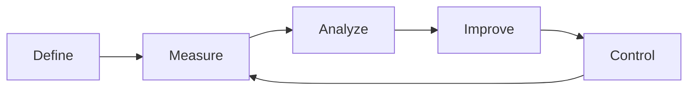

# React Native Performance Skills

DMAIC performance workflow for React Native and Expo apps. Define, Measure, Analyze, Improve, Control — a structured approach to finding and fixing performance issues.

Built as a companion to [callstackincubator/react-native-best-practices](https://github.com/callstackincubator/agent-skills/tree/main/skills/react-native-best-practices). That skill provides atomic optimization references (the "what" and "how"). This plugin adds the orchestration layer: **when** to do what, **how to interpret** profiling output, and **how to prevent regressions**.



## Quick Start

> [!WARNING]  
> These skills assume you have a working React Native development environment already set up — including Xcode/Android Studio, a running emulator or physical device, and a project that builds successfully. Always follow the official docs for [React Native](https://reactnative.dev/docs/set-up-your-environment) and [Expo](https://docs.expo.dev/get-started/set-up-your-environment/).


Install with `npx skills`:

```bash
npx skills install jeferson-sb/react-native-perf-skills
npx skills install callstackincubator/agent-skills --skill react-native-best-practices
```

Once installed, skills are available as slash commands in any React Native project:

```
/perf-quick          # Fast antipattern scan (no profiling needed)
/perf-define         # Scope a performance problem
/perf-measure fps    # Collect baseline metrics
/perf-analyze        # Find root cause
/perf-improve        # Apply targeted fixes
/perf-control        # Set up regression monitoring
```

## Try it on the demo app

The [`example/`](./example) directory contains **Janky Shop** — a small Expo app
(Feed → Detail → Settings) to practice the DMAIC workflow on. It looks like an ordinary app;
its performance problems only surface once you measure. Point the skills at it, find the
issues yourself, and watch the numbers move after `/perf-improve`.

```bash
cd example
npm install
npx expo prebuild   # for native profiling; or just `npx expo start` for a JS-only look
```

## Available Skills

| Skill | Command | Purpose |
|-------|---------|---------|
| **Quick** | `/perf-quick` | Grep-based scan for 12 high-impact antipatterns (ScrollView+map, Animated.Value, inline styles, barrel imports, etc.) |
| **Define** | `/perf-define` | DMAIC Phase 1 — Classify the symptom, identify the affected flow, set measurable targets, write a problem statement |
| **Measure** | `/perf-measure` | DMAIC Phase 2 — Route to the correct profiling tool (Flashlight, React DevTools, Xcode Instruments, Android Studio), interpret output |
| **Analyze** | `/perf-analyze` | DMAIC Phase 3 — Map metrics to root causes using pattern matching, search codebase for evidence, rank hypotheses |
| **Improve** | `/perf-improve` | DMAIC Phase 4 — Ordered fix checklists by category, battle-tested library lookups, deferred work patterns |
| **Control** | `/perf-control` | DMAIC Phase 5 — Set up callstack/reassure, Flashlight CI, bundle size thresholds, TTI monitoring |

## Specialist Agents

The plugin includes 4 specialist agents that can be spawned for deep investigation:

| Agent | Role |
|-------|------|
| `js-profiling-specialist` | React DevTools interpretation, re-render root cause analysis, memoization strategy |
| `native-profiling-specialist` | Xcode Instruments / Android Studio Profiler, threading issues, view hierarchy |
| `bundle-analysis-specialist` | Source map analysis, barrel import detection, dependency size evaluation |
| `regression-testing-specialist` | Reassure setup, Flashlight CI, bundle size guards (can write files) |

## Key References

The `skills/*/references/` directories contain detailed guides:

- **Flashlight output interpretation** — Score ranges mapped to root causes, FPS graph signatures, CI thresholds
- **React DevTools flamegraph guide** — "Why did this render?" patterns, ranked view analysis
- **Xcode Instruments guide** — Template selection, thread identification, hang detection
- **Android Studio Profiler guide** — CPU sampling, memory allocations, Perfetto traces
- **Battle-tested libraries tier list** — Opinionated S/A/B/C ranking (reanimated, gesture-handler, FlashList, etc.)
- **Deferred work patterns** — InteractionManager, useTransition, useDeferredValue
- **Metric targets** — FPS, TTI, bundle size, memory thresholds by device tier
- **Improvement checklists** — Step-by-step fix sequences for re-renders, animations, bundle, TTI, memory
- **Reassure setup** — Performance regression testing with CI integration
- **CI regression guards** — Three levels: bundle size, render counts, device benchmarks

## Performance Thresholds

Target scores used per problem domain. Based on industry benchmarks, Google Play guidelines, and real-world device testing.

### FPS / Jank

| Metric | Excellent | Acceptable | Needs Work |
|--------|-----------|------------|------------|
| Scroll FPS | 58–60 | 45–57 | < 45 |
| Animation FPS | 58–60 | 50–57 | < 50 |
| Flashlight Score | 80–100 | 60–79 | < 60 |
| Gesture response | < 16ms | < 32ms | > 32ms |

### Startup / TTI

| Metric | Excellent | Acceptable | Needs Work |
|--------|-----------|------------|------------|
| Cold start (total) | < 1.5s | 1.5–3s | > 3s |
| Warm start | < 0.5s | 0.5–1s | > 1s |
| JS bundle parse | < 500ms | 500ms–1s | > 1s |

### Bundle / App Size

| Metric | Excellent | Acceptable | Needs Work |
|--------|-----------|------------|------------|
| JS bundle (minified) | < 1.5MB | 1.5–3MB | > 3MB |
| App download (Android) | < 15MB | 15–30MB | > 30MB |
| App download (iOS) | < 30MB | 30–60MB | > 60MB |
| OTA update size | < 500KB | 500KB–1.5MB | > 1.5MB |

### Memory

| Metric | Excellent | Acceptable | Needs Work |
|--------|-----------|------------|------------|
| JS heap (per screen) | < 50MB | 50–100MB | > 100MB |
| Total RSS | < 200MB | 200–350MB | > 350MB |
| Growth per navigation | < 1MB | 1–5MB | > 5MB |

> **Principle**: Optimize for mid-range devices (Pixel 7a, Galaxy A54, iPhone SE 3). If it works on mid-range, it'll fly on high-end. If it breaks on low-end, investigate.

## Requirements

- **Peer dependency**: [react-native-best-practices](https://github.com/callstackincubator/agent-skills/tree/main/skills/react-native-best-practices) (provides atomic optimization references)
- **For Concurrent React patterns** (useTransition, useDeferredValue): React Native 0.76+ with New Architecture
- **For Flashlight**: Android device (Flashlight does not support iOS)
- **For Reassure CI**: Jest + React Testing Library configured

## Project Structure

```
react-native-perf-skills/
├── .claude-plugin/
│   └── plugin.json
├── skills/
│   ├── quick/
│   │   ├── SKILL.md
│   │   └── references/
│   ├── define/
│   │   ├── SKILL.md
│   │   └── references/
│   ├── measure/
│   │   ├── SKILL.md
│   │   └── references/
│   ├── analyze/
│   │   ├── SKILL.md
│   │   └── references/
│   ├── improve/
│   │   ├── SKILL.md
│   │   └── references/
│   └── control/
│       ├── SKILL.md
│       └── references/
├── agents/
│   ├── js-profiling-specialist.md
│   ├── native-profiling-specialist.md
│   ├── bundle-analysis-specialist.md
│   └── regression-testing-specialist.md
├── hooks/
│   ├── hooks.json
│   └── scripts/
│       └── session-start-reminder.sh
└── example/                # "Janky Shop" — deliberately slow demo app
    ├── app/                # expo-router screens (Feed, Detail, Settings)
    ├── src/                # data, context, components (antipattern hotspots)
    └── README.md           # screen-by-screen antipattern map
```

## License

MIT
